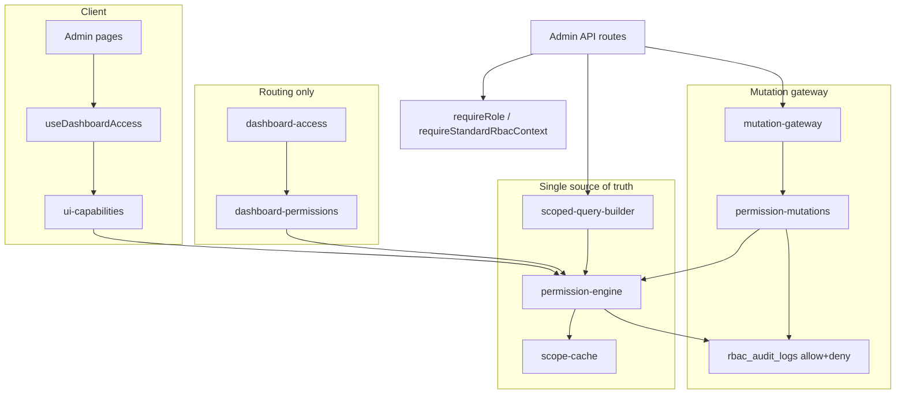

# RBAC Architecture Standard (production hardened)

This project uses a centralized, fail-closed RBAC model. **`permission-engine.ts` is the only authority** for allow/deny semantics. See `lib/rbac/authority.ts` for forbidden patterns.

## Layer diagram (Phase 4)



| Layer | Module | Responsibility |
|-------|--------|----------------|
| Authority | `permission-engine.ts` | `canView/Edit/Delete/Upload`, `canAccessScope`, `canCreateGroup`, `canTargetAudience` |
| Entitlements | `dashboard-permissions.ts` | Module matrix, filters, form profiles (delegates to engine) |
| Routing | `dashboard-access.ts` | Paths, API map, sidebar, analytics scope **mapping only** |
| UI | `ui-capabilities.ts` | Client capability bundle (no standalone rules) |
| Reads DB | `scoped-query-builder.ts` | List predicates aligned with engine scope |
| Writes | `mutation-gateway.ts` | `canPerformMutation` — all mutations; audits allow + deny |
| SQL analytics | `lib/admin/rbac.ts` | Parameterized analytics scope (server-only) |

## Production validation (stabilization)

Run before release:

```bash
cd socialbot && npm test -- tests/rbac/ tests/security/dashboard-reader-rbac.contract.test.ts
```

| Suite | Covers |
|-------|--------|
| `production-regression.test.ts` | All panel roles: events, upload, broadcast, twitter, scope cache |
| `mobile-admin-visibility-parity.test.ts` | `content-visibility` ↔ `eventVisibilityMatch` |
| `scoped-query-builder.test.ts` | DB pre-filters (moderator state overlap, CM `target_groups`) |
| `permission-audit.test.ts` | `rbac_audit_logs` payload shape |
| `dashboard-reader-rbac.contract.test.ts` | Mobile/SQL `dashboard_visibility_match` mirror |

Indexes: `supabase/migrations/20260521150000_rbac_visibility_query_indexes.sql`

Legacy map: `docs/RBAC_LEGACY_CLEANUP.md`

## Core Engines

- **Scope cache** (`lib/rbac/scope-cache.ts`) — `getCachedNormalizedScope()` memoizes assignment normalization (60s TTL).

- **Permission audit** (`lib/rbac/permission-audit.ts` + `rbac_audit_logs` table) — `logPermissionDecision()` for API/mutation trails.

- **UI capabilities** (`lib/rbac/ui-capabilities.ts` + `lib/hooks/useDashboardAccess.ts`) — client pages must use these instead of `role ===` checks.

- **Mobile visibility** (`lib/rbac/content-visibility.ts` at repo root, used by `utils/visibility.ts`) — aligned with SQL `dashboard_visibility_match`.

- **RBAC Debug** (`/admin/rbac-debug`, `lib/rbac/rbac-debug-eval.ts`) — admin-only permission inspector.

- **Dashboard access** (`lib/rbac/dashboard-access.ts`)
  - Single source for sidebar modules, route/API guards, filter visibility, analytics/leaderboard/broadcast/twitter scope.
  - Functions: `getVisibleSidebarItems`, `canAccessDashboardModule`, `canUseGlobalFilters`, `getAnalyticsScope`, `getLeaderboardScope`, `getBroadcastScope`, `getTwitterCampaignScope`.
  - Debug channel: `[dashboard-rbac]` logs (`role`, `allowed_modules`, `denied_module`, `active_scope`, `global_filter_access`).

- **Permission engine** (`lib/rbac/permission-engine.ts`, barrel `lib/rbac/index.ts`)
  - `canViewEvent`, `canEditEvent`, `canDeleteEvent`, `canUploadPost`, `canCreateGroup`, `canTargetAudience`
  - `normalizeScope`, `canAccessScope` (`lib/rbac/normalize-scope.ts`)
  - Cross-role published visibility: moderator / campaign_manager / editor see each other's **published** events when **state and party** overlap (visibility does not grant edit/upload).
  - Global targeting (`0`, `ALL`, dashboard category): **admin only**.
  - Empty filter arrays on a dimension = no extra restriction **inside** assigned scope (never all-India).

- `requireRole` / `requireStandardRbacContext` (`lib/rbac/require.ts`)
  - Entry gate for authenticated admin APIs.
  - Enforces role allowlists.
  - Enforces assignment integrity:
    - moderator requires non-empty `assigned_state_ids`
    - campaign_manager requires non-empty canonical `assigned_group_ids`

- `canAccessResource` (`lib/rbac/unified-scope-engine.ts`)
  - Unified read/access decision engine.
  - Handles role scope decisions and denied observability/audit emission.

- `buildScopedQuery` / `buildScopedAnalyticsQuery` (`lib/rbac/scoped-query-builder.ts`)
  - Database-layer query scoping.
  - Prevents fetch-then-filter RBAC drift.

- `canPerformMutation` (`lib/rbac/mutation-gateway.ts`)
  - Centralized write/mutation authorization.
  - `auditRbacMutation` logs **allowed + denied** when routes pass `audit` context.
  - Denials also emit RBAC observability + `admin_actions`.

- `RBAC_RESOURCE_REGISTRY` (`lib/rbac/resource-classification.ts`)
  - Canonical resource policy registry:
    - scope model
    - fallback policy
    - supported RBAC layers
    - analytics behavior

## Canonical Scope Semantics

### Moderator

- Resource scope must be a **subset** of `assigned_state_ids`.
- Missing/malformed state scope => deny (fail-closed).

### Campaign Manager

- Resource group scope (`group_id` / `group_ids`) must be a **subset** of `assigned_group_ids`.
- Missing/malformed group scope => deny (fail-closed).

### Admin

- Global access, unchanged.

### Overlap vs Subset

- **Subset is the default policy** for scoped resources.
- Overlap checks are not used for authorization decisions.
- This avoids scope leakage and cross-layer semantic drift.

## ID Normalization Standard

- State IDs: positive integers.
- Group IDs: canonical numeric strings (`"01"` normalized to `"1"`).
- Use `parseStateIds`, `parseGroupIds`, `normalizeStateId`, `normalizeGroupId` from `require.ts`.
- Do not compare mixed raw string/number IDs in route code.

## Ownership Fallback Policy

- Scoped resources must not silently fall back to ownership when scope is missing.
- Ownership fallback is allowed only for explicitly registered owner-only/legacy resources in `RBAC_RESOURCE_REGISTRY`.

## Unknown Resource Handling

- Unknown/unregistered resource types are denied.
- No `created_by=self` silent fallback for unregistered resources.
- Use `validateRegisteredResourceForLayer(...)` via the centralized engines.

## Standard Route Pattern

1. Validate session.
2. `requireStandardRbacContext(auth, [...allowedRoles])`.
3. DB reads:
   - use `buildScopedQuery` / `buildScopedAnalyticsQuery`.
4. Mutations:
   - call `canPerformMutation(...)` before write.
5. Optional explicit read guard:
   - `canAccessResource(...)` for pre-read detail checks.

## Denied Event Consistency

- Denied access/mutation should produce:
  - RBAC observability event
  - admin audit log entry
- Centralized engines already do this for resource validation and mutation denials.

Use direct `return 403` only for pre-RBAC request shape errors; prefer engine-driven denial for policy decisions.
